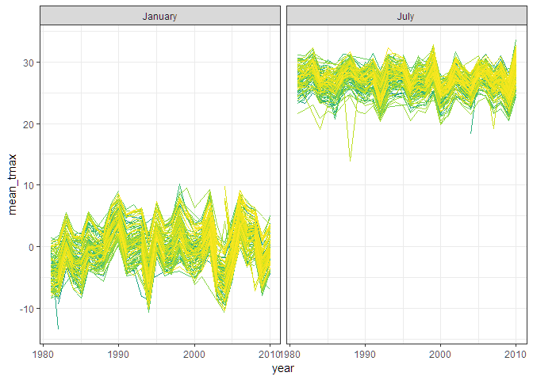

p8105\_hw3\_yc3242
================
Youn Kyeong Chang (uni\# yc3242)
October 10, 2018

I used the tidyverse library and some options for outset through the whole problem set.

``` r
library(tidyverse)
```

    ## -- Attaching packages -------------------------------------------------------- tidyverse 1.2.1 --

    ## v ggplot2 3.0.0     v purrr   0.2.5
    ## v tibble  1.4.2     v dplyr   0.7.6
    ## v tidyr   0.8.1     v stringr 1.3.1
    ## v readr   1.1.1     v forcats 0.3.0

    ## -- Conflicts ----------------------------------------------------------- tidyverse_conflicts() --
    ## x dplyr::filter() masks stats::filter()
    ## x dplyr::lag()    masks stats::lag()

``` r
theme_set(theme_bw() + theme(legend.position = "bottom"))
```

Problem 1
=========

First, I loaded the dataset for problem 1 from the following library.

``` r
library(p8105.datasets)
data("brfss_smart2010")
```

Next, I cleaned the data and focused on the `Overall Health` topic and organized responses as factor taking levels ordered from "Excellent" to "Poor".

``` r
response_levels = c("Excellent", "Very good", "Good", "Fair", "Poor")

brfss_smart2010 = brfss_smart2010 %>% 
  janitor::clean_names() %>%                          # clean variable names
  rename(state = locationabbr,
         location = locationdesc) %>% 
  filter(topic == "Overall Health") %>% 
  mutate(response = factor(response, levels = response_levels))
```

First, to find out the states which were observed at 7 locations in 2002, I retained distinct rows by state and location and counted the number of states.

``` r
brfss_smart2010 %>% 
  filter(year == 2002) %>%
  distinct(state, location) %>% 
  count(state)  %>% 
  filter(n == 7)
```

    ## # A tibble: 3 x 2
    ##   state     n
    ##   <chr> <int>
    ## 1 CT        7
    ## 2 FL        7
    ## 3 NC        7

In 2002, **CT, FL, NC** were observed at 7 locations.

Next, I made a “spaghetti plot” that shows the number of locations in each state from 2002 to 2010.

``` r
brfss_smart2010 %>% 
  group_by(state, year) %>%
  distinct(location) %>%
  mutate(n_location = n()) %>% 
  ggplot(aes(x = year, y = n_location)) +
  geom_line(aes(color = state)) +
  labs(
    title = "Number of locations across states from 2002 to 2010",
    x = "Year",
    y = "Number of locations"
  ) +
  theme(plot.title = element_text(size = 16),
        legend.key.width = unit(.3, "cm"),
        legend.text = element_text(size = 7)) +
  guides(color = guide_legend(ncol = 17)) +
  viridis::scale_color_viridis(
    name = "State",
    discrete = TRUE
    ) 
```


This spaghetti plot shows that from 2002 to 2010, the number of locations of state seems constant, slightly fluctuating below 20 except that there is a huge surge in 2007 and 2010 in Florida.

Also, I made a table showing, for the years 2002, 2006, and 2010, the mean and standard deviation of the proportion of “Excellent” responses across locations in NY State.

``` r
brfss_smart2010 %>%
  filter(year %in% c(2002, 2006, 2010), 
         state == "NY", 
         response == "Excellent") %>% 
  group_by(year) %>% 
  summarize("Average proportion of Excellent(%) " = mean(data_value), 
            "Standard deviation of proportion of Excellent(%)" = sd(data_value)) %>% 
  knitr::kable(digits = 2)
```

|  year| Average proportion of Excellent(%) |  Standard deviation of proportion of Excellent(%)|
|-----:|:----------------------------------:|-------------------------------------------------:|
|  2002|                24.04               |                                              4.49|
|  2006|                22.53               |                                              4.00|
|  2010|                22.70               |                                              3.57|

The average and deviation of the proportion of Excellent responses across locations in NY state were the highest in 2002 and the values are similar in 2006 and 2010.

For each year and state, I computed the average proportion in each response category (taking the average across locations in a state) and made a five-panel plot that shows, for each response category separately, the distribution of these state-level averages over time.

``` r
brfss_smart2010 %>% 
  group_by(year, state, response) %>% 
  summarize(mean_response = mean(data_value)) %>% 
  ggplot(aes(x = factor(year), y = mean_response)) +     
  geom_violin(aes(fill = factor(year))) +
  stat_summary(fun.y = mean, geom = "point", color = "black") +
  facet_grid( ~ response) +
  labs(
    x = "Year",
    y = "Average proportion(%)",
    title = "Average proportion in each response category from 2002 to 2010"
  ) +
 theme(plot.title = element_text(size = 16),
        legend.key.width = unit(.3, "cm"),
        legend.text = element_text(size = 7),
       axis.text.x = element_text(size = 5),
       legend.position = "none") +
  guides(color = guide_legend(ncol = 17)) +
  viridis::scale_fill_viridis(
    name = "State",
    discrete = TRUE) 
```

    ## Warning: Removed 21 rows containing non-finite values (stat_ydensity).

    ## Warning: Removed 21 rows containing non-finite values (stat_summary).


Given that for every category, the plots by state are overlapped, we can conclude that the trend of responses is similar across states. The mean of average proportion is ordered as Very good &gt; Good &gt; Excellent &gt; Fair &gt; Poor from the highest and the lowest.

Problem 2
=========

First, I loaded the dataset for problem 2 from the following library.

``` r
library(p8105.datasets)
data("instacart") 
```

This `instacart` data is composed of **1384617** rows and **15** columns, where each row is corresponding to a product from an order. Each column represents as follows:

-   `order_id`: order identifier
-   `product_id`: product identifier
-   `add_to_cart_order`: order in which each product was added to cart
-   `reordered`: 1 if this prodcut has been ordered by this user in the past, 0 otherwise
-   `user_id`: customer identifier
-   `eval_set`: which evaluation set this order belongs in (Note that the data for use in this class is exclusively from the “train” eval\_set)
-   `order_number`: the order sequence number for this user (1=first, n=nth)
-   `order_dow`: the day of the week on which the order was placed
-   `order_hour_of_day`: the hour of the day on which the order was placed
-   `days_since_prior_order`: days since the last order, capped at 30, NA if order\_number=1
-   `product_name`: name of the product
-   `aisle_id`: aisle identifier
-   `department_id`: department identifier
-   `aisle`: the name of the aisle
-   `department`: the name of the department

From key variables such as `reordered`, `user_id`, `order_dow`, `order_hour_of_day`, `product_name`, `aisle` and `department`, some interesting findings are as below:

-   Fresh fruits and vegetables are reordered frequently.

``` r
instacart %>% 
  group_by(aisle) %>% 
  filter(reordered == 1) %>%
  count() %>% 
  arrange(desc(n))
```

    ## # A tibble: 134 x 2
    ## # Groups:   aisle [134]
    ##    aisle                              n
    ##    <chr>                          <int>
    ##  1 fresh fruits                  110782
    ##  2 fresh vegetables               91368
    ##  3 packaged vegetables fruits     51523
    ##  4 yogurt                         37939
    ##  5 water seltzer sparkling water  27011
    ##  6 milk                           25864
    ##  7 packaged cheese                24897
    ##  8 chips pretzels                 18649
    ##  9 soy lactosefree                18046
    ## 10 bread                          16073
    ## # ... with 124 more rows

-   Orders tend to be made from 10 am to 5 pm.

``` r
instacart %>% 
  count(order_hour_of_day) %>% 
  arrange(desc(n))
```

    ## # A tibble: 24 x 2
    ##    order_hour_of_day      n
    ##                <int>  <int>
    ##  1                14 119370
    ##  2                15 116198
    ##  3                13 114762
    ##  4                11 114119
    ##  5                12 111752
    ##  6                10 110479
    ##  7                16 110237
    ##  8                17  96944
    ##  9                 9  93856
    ## 10                18  76522
    ## # ... with 14 more rows

-   In general, 9 purchases were made per one person and 80 purchases at max.

``` r
instacart %>% 
  count(user_id) %>% 
  summarize(order_max = max(n), 
            order_median = median(n), 
            order_min = min(n),
            order_mean = round(mean(n), 1)) %>% 
  knitr::kable()
```

|  order\_max|  order\_median|  order\_min|  order\_mean|
|-----------:|--------------:|-----------:|------------:|
|          80|              9|           1|         10.6|

-   **\[Question\]** There are **134** aisles in the dataset.

-   **\[Question\]** The aisles below are the most items ordered from.

``` r
instacart %>% 
  count(aisle) %>% 
  top_n(3) %>% 
  knitr::kable()
```

    ## Selecting by n

| aisle                      |       n|
|:---------------------------|-------:|
| fresh fruits               |  150473|
| fresh vegetables           |  150609|
| packaged vegetables fruits |   78493|

A plot below shows the number of items ordered in each aisle.

``` r
instacart %>%
  count(aisle) %>% 
  mutate(aisle = forcats::fct_reorder(aisle, n, .asc = TRUE)) %>% 
  ggplot(aes(x = aisle, y = n)) + 
  geom_bar(stat = "identity",                 ## bar represents values not count
           width = .3,
           fill = "#E69F00") +
  labs(title = "Number of items ordered in each aisle",
       x = "Number of orders",
       y = "Aisle") +
  theme(axis.text.y = element_text(hjust = 1),
        axis.text = element_text(size = 7.5)) +
  coord_flip()
```


As shown above, fresh vegetables, fresh fruits and packaged vegetables fruits are the top 3 popular items. Beauty, frozen juice and baby accessories are the least purchased items.

Following table shows the most popular item in each of the aisles “baking ingredients”, “dog food care”, and “packaged vegetables fruits”.

``` r
instacart %>%
  filter(aisle %in% c("baking ingredients", 
                      "dog food care", 
                      "packaged vegetables fruits")) %>% 
  group_by(aisle) %>% 
  count(product_name) %>% 
  filter(min_rank(desc(n)) == 1) %>% 
  rename("Aisle" = aisle,
         "Product name" = product_name,
         "Number of orders" = n) %>% 
  knitr::kable()
```

| Aisle                      | Product name                                  |  Number of orders|
|:---------------------------|:----------------------------------------------|-----------------:|
| baking ingredients         | Light Brown Sugar                             |               499|
| dog food care              | Snack Sticks Chicken & Rice Recipe Dog Treats |                30|
| packaged vegetables fruits | Organic Baby Spinach                          |              9784|

Light brown sugar, snack sticks chicken & rice recipe dog treats and organic baby spinach are the most purchased item in baking ingredients, dog food care and packaged vegetables fruits aisle, respectively. Even though these products are the most popular item in each aisle, there is a huge gap between the number of orders.

A table below shows the mean hour of the day with the scale of 24-hour clock at which Pink Lady Apples and Coffee Ice Cream are ordered on each day of the week. For more readable visualization, I converted numeric `order_dow` variable to characteristic `days_of_the_week` variable in a way that from `0` to `6` to from `Sunday` to `Saturday`.

``` r
dow_names = 
  c("Sunday", "Monday", "Tuesday", "Wednesday", "Thursday", "Friday", "Saturday")

instacart %>%
  filter(product_name %in% c("Pink Lady Apples", "Coffee Ice Cream")) %>% 
  group_by(product_name, order_dow) %>% 
  summarize(mean_order_hod = round(mean(order_hour_of_day), 1)) %>% 
  mutate(order_dow = factor(dow_names[order_dow + 1], levels = dow_names)) %>% 
  spread(key = order_dow, value = mean_order_hod) %>% 
  rename("Product name" = product_name) %>% 
  knitr::kable()
```

| Product name     |  Sunday|  Monday|  Tuesday|  Wednesday|  Thursday|  Friday|  Saturday|
|:-----------------|-------:|-------:|--------:|----------:|---------:|-------:|---------:|
| Coffee Ice Cream |    13.8|    14.3|     15.4|       15.3|      15.2|    12.3|      13.8|
| Pink Lady Apples |    13.4|    11.4|     11.7|       14.2|      11.6|    12.8|      11.9|

On Friday, coffe ice cream is ordered earlier than other days of the week and on Tuesday the other way around. Pink lady apples are purchased around lunch time between 11 am to 2 pm.

Problem 3
=========

``` r
library(p8105.datasets)
data("ny_noaa")
```

This `ny_noaa` data has **2595176** rows and **7** columns, containing following variables:

-   `id`: Weather station ID
-   `date`: Date of observation
-   `prcp`: Precipitation (tenths of mm)
-   `snow`: Snowfall (mm)
-   `snwd`: Snow depth (mm)
-   `tmax`: Maximum temperature (tenths of degrees C)
-   `tmin`: Minimum temperature (tenths of degrees C)

First, I did some data cleaning by creating separate variables for year, month, and day. Also, I entered omitted decimal points on `prcp`, `tmax` and `tmin` variables.

``` r
ny_noaa =
  ny_noaa %>%
  separate(date, into = c("year", "month", "day"), sep = "-") %>%
  mutate(year = as.integer(year),
         month = factor(month.name[as.integer(month)], levels = month.name),
         day = as.integer(day),
         prcp = prcp / 10,
         tmax = as.numeric(tmax) / 10,
         tmin = as.numeric(tmin) / 10)
```

The table below indicates 0 mm as the most frequently observed value of snowfall, implying that in most of days there are no snows in NY.

``` r
ny_noaa %>%
  count(snow) %>%
  arrange(desc(n)) %>%
  top_n(3) %>%
  rename("Snowfall(mm)" = snow,
         "Number of observations" = n) %>%
  knitr::kable()
```

    ## Selecting by n

|  Snowfall(mm)|  Number of observations|
|-------------:|-----------------------:|
|             0|                 2008508|
|            NA|                  381221|
|            25|                   31022|

Make a two-panel plot showing the average max temperature in January and in July in each station across years. Is there any observable / interpretable structure? Any outliers?

``` r
ny_noaa %>%
  filter(month %in% c("January", "July")) %>%
  group_by(id, year, month) %>%
  summarize(mean_tmax = mean(tmax, na.rm = TRUE)) %>%
  ggplot(aes(x = year, y = mean_tmax, group = id)) +
  geom_line(aes(color = id)) +
  theme(legend.position = "none") +
  facet_grid(~ month) +
  viridis::scale_color_viridis(
    name = "id",
    discrete = TRUE
  )
```

    ## Warning: Removed 5640 rows containing missing values (geom_path).



Finally, I made a two-panel plot showing

1.  tmax vs tmin for the full dataset

``` r
library(hexbin)

ny_noaa %>%
  filter(!is.na(tmax),
         !is.na(tmin)) %>%
  ggplot(aes(x = tmax, y = tmin)) +
  geom_hex() +
  labs(title = "Temperature from 1981-2010",
       x = "Maximum temperature (°C)",
       y = "Minimum temperature (°C)")
```


1.  Distribution of snowfall values greater than 0 and less than 100 separately by year.

``` r
ny_noaa %>%
  filter(snow > 0, snow < 100) %>%
  ggplot(aes(x = snow, color = factor(year))) +
  geom_density() +
  labs(
    x = "Snowfall(mm)",
    y = "Density",
    title = "Distribution of snowfall, 0 ~ 100(mm)"
  ) +
  theme(plot.title = element_text(size = 16),
        legend.key.width = unit(.3, "cm"),
        legend.text = element_text(size = 7)) +
  guides(color = guide_legend(ncol = 15)) +
  viridis::scale_color_viridis(
    name = "Year",
    discrete = TRUE)
```


To that end, write a short description of the dataset, noting the size and structure of the data, describing some key variables, and indicating the extent to which missing data is an issue. Then, do or answer the following (commenting on the results of each):

``` r
ny_noaa %>%
  summarise_at(vars(prcp:tmin), .funs = function(x) mean(is.na(x))) %>%
  knitr::kable(digits = 2)
```

|  prcp|  snow|  snwd|  tmax|  tmin|
|-----:|-----:|-----:|-----:|-----:|
|  0.06|  0.15|  0.23|  0.44|  0.44|

``` r
ny_noaa %>%
  group_by(month) %>%
  summarise_at(vars(prcp:tmin), .funs = function(x) mean(is.na(x))) %>%
  knitr::kable(digits = 2)
```

| month     |  prcp|  snow|  snwd|  tmax|  tmin|
|:----------|-----:|-----:|-----:|-----:|-----:|
| January   |  0.07|  0.18|  0.29|  0.43|  0.43|
| February  |  0.07|  0.17|  0.29|  0.42|  0.42|
| March     |  0.06|  0.16|  0.28|  0.43|  0.43|
| April     |  0.05|  0.12|  0.21|  0.43|  0.43|
| May       |  0.04|  0.12|  0.17|  0.44|  0.44|
| June      |  0.05|  0.14|  0.18|  0.44|  0.44|
| July      |  0.05|  0.14|  0.18|  0.44|  0.44|
| August    |  0.05|  0.13|  0.18|  0.44|  0.44|
| September |  0.05|  0.13|  0.18|  0.44|  0.44|
| October   |  0.05|  0.12|  0.22|  0.45|  0.45|
| November  |  0.06|  0.17|  0.27|  0.45|  0.45|
| December  |  0.08|  0.19|  0.30|  0.44|  0.44|
