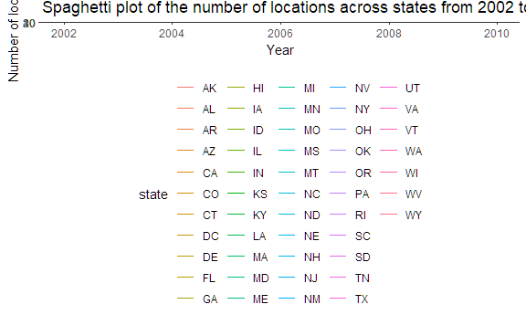
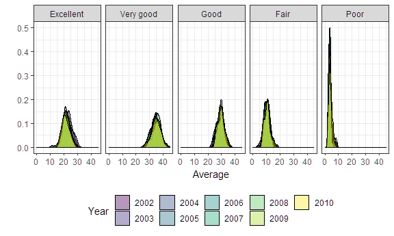
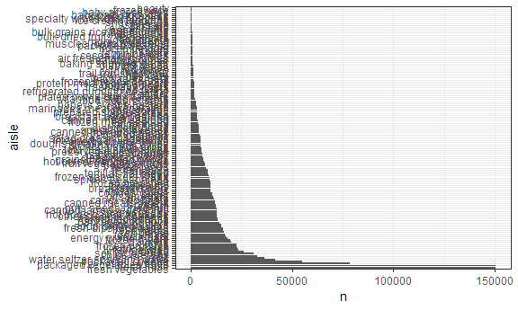

p8105\_hw3\_yc3242
================
Youn Kyeong Chang (uni\# yc3242)
October 10, 2018

I used the tidyverse library and some options for outset through the whole problem set.

``` r
library(tidyverse)
```

    ## -- Attaching packages -------------------------------------------------------- tidyverse 1.2.1 --

    ## v ggplot2 3.0.0     v purrr   0.2.5
    ## v tibble  1.4.2     v dplyr   0.7.6
    ## v tidyr   0.8.1     v stringr 1.3.1
    ## v readr   1.1.1     v forcats 0.3.0

    ## -- Conflicts ----------------------------------------------------------- tidyverse_conflicts() --
    ## x dplyr::filter() masks stats::filter()
    ## x dplyr::lag()    masks stats::lag()

``` r
knitr::opts_chunk$set(
  fig.width = 6,
  fig.asp = .6,
  out.width = "90%"
)

theme_set(theme_bw() + theme(legend.position = "bottom"))
```

Problem 1
=========

First, I loaded the dataset for problem 1 from the following library.

``` r
library(p8105.datasets)
data("brfss_smart2010")
```

Next, I cleaned the data and focused on the `Overall Health` topic and organized responses as factor taking levels ordered from "Excellent" to "Poor".

``` r
response_levels = c("Excellent", "Very good", "Good", "Fair", "Poor")

brfss_smart2010 = brfss_smart2010 %>% 
  janitor::clean_names() %>%                          # clean variable names
  rename(state = locationabbr,
         location = locationdesc) %>% 
  filter(topic == "Overall Health") %>% 
  mutate(response = factor(response, levels = response_levels))
```

First, to find out the states which were observed at 7 locations in 2002, I retained distinct rows by state and location and counted the number of states.

``` r
brfss_smart2010 %>% 
  filter(year == 2002) %>%
  distinct(state, location) %>% 
  count(state)  %>% 
  filter(n == 7)
```

    ## # A tibble: 3 x 2
    ##   state     n
    ##   <chr> <int>
    ## 1 CT        7
    ## 2 FL        7
    ## 3 NC        7

In 2002, **CT, FL, NC** were observed at 7 locations.

Next, I made a “spaghetti plot” that shows the number of locations in each state from 2002 to 2010.

``` r
brfss_smart2010 %>% 
  group_by(state, year) %>%
  distinct(location) %>%
  mutate(n_location = n()) %>% 
  ggplot(aes(x = year, y = n_location)) +
  geom_line(aes(color = state)) +
  labs(
    title = "Spaghetti plot of the number of locations across states from 2002 to 2010",
    x = "Year",
    y = "Number of locations"
  )
```



``` r
  viridis::scale_color_viridis(
    name = "State",
    discrete = TRUE
    ) 
```

    ## <ggproto object: Class ScaleDiscrete, Scale, gg>
    ##     aesthetics: colour
    ##     axis_order: function
    ##     break_info: function
    ##     break_positions: function
    ##     breaks: waiver
    ##     call: call
    ##     clone: function
    ##     dimension: function
    ##     drop: TRUE
    ##     expand: waiver
    ##     get_breaks: function
    ##     get_breaks_minor: function
    ##     get_labels: function
    ##     get_limits: function
    ##     guide: legend
    ##     is_discrete: function
    ##     is_empty: function
    ##     labels: waiver
    ##     limits: NULL
    ##     make_sec_title: function
    ##     make_title: function
    ##     map: function
    ##     map_df: function
    ##     n.breaks.cache: NULL
    ##     na.translate: TRUE
    ##     na.value: NA
    ##     name: State
    ##     palette: function
    ##     palette.cache: NULL
    ##     position: left
    ##     range: <ggproto object: Class RangeDiscrete, Range, gg>
    ##         range: NULL
    ##         reset: function
    ##         train: function
    ##         super:  <ggproto object: Class RangeDiscrete, Range, gg>
    ##     reset: function
    ##     scale_name: viridis
    ##     train: function
    ##     train_df: function
    ##     transform: function
    ##     transform_df: function
    ##     super:  <ggproto object: Class ScaleDiscrete, Scale, gg>

This spaghetti plot shows that the number of locations of state seems constant, fluctuating below 20 except that there is a huge surge in 2007 and 2010 in Florida.

Then, I made a table showing, for the years 2002, 2006, and 2010, the mean and standard deviation of the proportion of “Excellent” responses across locations in NY State.

``` r
brfss_smart2010 %>%
  filter(year %in% c(2002, 2006, 2010), 
         state == "NY", 
         response == "Excellent") %>% 
  group_by(year) %>% 
  summarize(mean = mean(data_value), sd = sd(data_value)) %>% 
  knitr::kable(digits = 2)
```

|  year|   mean|    sd|
|-----:|------:|-----:|
|  2002|  24.04|  4.49|
|  2006|  22.53|  4.00|
|  2010|  22.70|  3.57|

The average and deviation of the proportion of Excellent responses across locations in NY state were the highest in 2002.

For each year and state, I computed the average proportion in each response category (taking the average across locations in a state) and made a five-panel plot that shows, for each response category separately, the distribution of these state-level averages over time.

``` r
brfss_smart2010 %>% 
  group_by(year, state, response) %>% 
  summarize(mean = mean(data_value)) %>% 
  ggplot(aes(x = mean, fill = as.factor(year))) +    
  geom_density(alpha = .4) +
  facet_grid(~ response) +
  labs(
    x = "Average",
    y = " "
  ) +
  scale_x_continuous(breaks = c(0, 10, 20, 30, 40, 50),
                     limits = c(0, 45)) +
  scale_y_continuous(limits = c(0, 0.5)) +
  viridis::scale_fill_viridis(
    name = "Year",
    discrete = TRUE) 
```

    ## Warning: Removed 21 rows containing non-finite values (stat_density).



The order of average proportion is Very good &gt; Good &gt; Excellent &gt; Fair &gt; Poor from the highest and the lowest. Even though the poor response has the lowest average proportion, the density is the highest and its deviation is very narrow. Given that for every category, the density plots by years are overlapped, we can conclude that the response is similar over time.

Problem 2
=========

First, I loaded the dataset for problem 2 from the following library.

``` r
library(p8105.datasets)
data("instacart") %>% 
  janitor::clean_names()
```

    ##        <NA> 
    ## "instacart"

There are **134** aisles in the dataset. The aisles below are the most items ordered from.

``` r
instacart %>% 
  count(aisle) %>% 
  top_n(3)
```

    ## Selecting by n

    ## # A tibble: 3 x 2
    ##   aisle                           n
    ##   <chr>                       <int>
    ## 1 fresh fruits               150473
    ## 2 fresh vegetables           150609
    ## 3 packaged vegetables fruits  78493

Make a plot that shows the number of items ordered in each aisle. Order aisles sensibly, and organize your plot so others can read it.

``` r
instacart %>%
  count(aisle) %>% 
  mutate(aisle = forcats::fct_reorder(aisle, n, .desc = TRUE)) %>% 
  ggplot(aes(x = aisle, y = n)) +
  geom_bar(stat = "identity") +
  coord_flip()
```



Make a table showing the most popular item in each of the aisles “baking ingredients”, “dog food care”, and “packaged vegetables fruits”.

``` r
instacart %>%
  filter(aisle %in% c("baking ingredients", "dog food care", "packaged vegetables fruits")) %>% 
  group_by(aisle) %>% 
  count(product_name) %>% 
  filter(min_rank(desc(n)) == 1)
```

    ## # A tibble: 3 x 3
    ## # Groups:   aisle [3]
    ##   aisle                    product_name                                  n
    ##   <chr>                    <chr>                                     <int>
    ## 1 baking ingredients       Light Brown Sugar                           499
    ## 2 dog food care            Snack Sticks Chicken & Rice Recipe Dog T~    30
    ## 3 packaged vegetables fru~ Organic Baby Spinach                       9784

Make a table showing the mean hour of the day at which Pink Lady Apples and Coffee Ice Cream are ordered on each day of the week; format this table for human readers (i.e. produce a 2 x 7 table).

``` r
days = 
  c("Sunday", "Monday", "Tuesday", "Wednesday", "Thursday", "Friday", "Saturday")

instacart %>%
  filter(product_name %in% c("Pink Lady Apples", "Coffee Ice Cream")) %>% 
  group_by(product_name, order_dow) %>% 
  summarize(mean = mean(order_hour_of_day)) %>% 
  mutate(order_dow = factor(days[order_dow + 1], levels = days)) %>% 
  spread(key = order_dow, value = mean)
```

    ## # A tibble: 2 x 8
    ## # Groups:   product_name [2]
    ##   product_name     Sunday Monday Tuesday Wednesday Thursday Friday Saturday
    ##   <chr>             <dbl>  <dbl>   <dbl>     <dbl>    <dbl>  <dbl>    <dbl>
    ## 1 Coffee Ice Cream   13.8   14.3    15.4      15.3     15.2   12.3     13.8
    ## 2 Pink Lady Apples   13.4   11.4    11.7      14.2     11.6   12.8     11.9

To that end, write a short description of the dataset, noting the size and structure of the data, describing some key variables, and giving illstrative examples of observations. Then, do or answer the following (commenting on the results of each):
