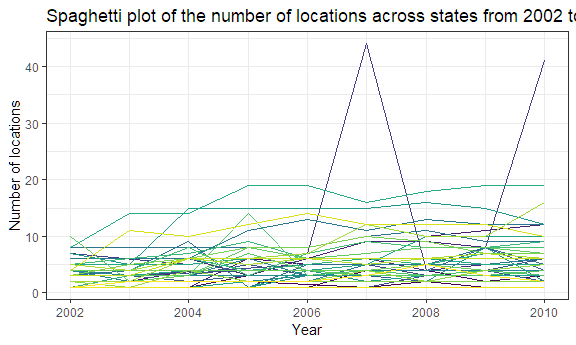

p8105\_hw3\_yc3242
================
Youn Kyeong Chang (uni\# yc3242)
October 10, 2018

I used the tidyverse library and some options for outset through the whole problem set.

``` r
library(tidyverse)
```

    ## -- Attaching packages -------------------------------------------------------- tidyverse 1.2.1 --

    ## v ggplot2 3.0.0     v purrr   0.2.5
    ## v tibble  1.4.2     v dplyr   0.7.6
    ## v tidyr   0.8.1     v stringr 1.3.1
    ## v readr   1.1.1     v forcats 0.3.0

    ## -- Conflicts ----------------------------------------------------------- tidyverse_conflicts() --
    ## x dplyr::filter() masks stats::filter()
    ## x dplyr::lag()    masks stats::lag()

``` r
#knitr::opts_chunk$set(
#  fig.width = 6,
#  fig.asp = .6,
#  out.width = "90%"
#)

theme_set(theme_bw() + theme(legend.position = "bottom"))
```

Problem 1
=========

First, I loaded the dataset for problem 1 from the following library.

``` r
library(p8105.datasets)
data("brfss_smart2010")
```

Next, I cleaned the data and focused on the `Overall Health` topic and organized responses as factor taking levels ordered from "Excellent" to "Poor".

``` r
response_levels = c("Excellent", "Very good", "Good", "Fair", "Poor")

brfss_smart2010 = brfss_smart2010 %>% 
  janitor::clean_names() %>%                          # clean variable names
  rename(state = locationabbr,
         location = locationdesc) %>% 
  filter(topic == "Overall Health") %>% 
  mutate(response = factor(response, levels = response_levels))
```

First, to find out the states which were observed at 7 locations in 2002, I retained distinct rows by state and location and counted the number of states.

``` r
brfss_smart2010 %>% 
  filter(year == 2002) %>%
  distinct(state, location) %>% 
  count(state)  %>% 
  filter(n == 7)
```

    ## # A tibble: 3 x 2
    ##   state     n
    ##   <chr> <int>
    ## 1 CT        7
    ## 2 FL        7
    ## 3 NC        7

In 2002, **CT, FL, NC** were observed at 7 locations.

Next, I made a “spaghetti plot” that shows the number of locations in each state from 2002 to 2010.

``` r
brfss_smart2010 %>% 
  group_by(state, year) %>%
  mutate(n_location = n()) %>% 
  distinct(state, year, .keep_all = TRUE) %>% 
  ggplot(aes(x = year, y = n_location, group = state)) +
  geom_line()
```



Then, I made a table showing, for the years 2002, 2006, and 2010, the mean and standard deviation of the proportion of “Excellent” responses across locations in NY State.

``` r
brfss_smart2010 %>%
  filter(year %in% c(2002, 2006, 2010), 
         state == "NY", 
         response == "Excellent") %>% 
  group_by(year) %>% 
  summarize(mean = mean(data_value), sd = sd(data_value)) %>% 
  knitr::kable(digits = 2)
```

|  year|   mean|    sd|
|-----:|------:|-----:|
|  2002|  24.04|  4.49|
|  2006|  22.53|  4.00|
|  2010|  22.70|  3.57|

For each year and state, I computed the average proportion in each response category (taking the average across locations in a state) and made a five-panel plot that shows, for each response category separately, the distribution of these state-level averages over time.

``` r
library(patchwork)

# Data setting across response categories
mean_responses = brfss_smart2010 %>% 
                 group_by(year, state, response) %>% 
                 summarize(mean = mean(data_value))


# Excellent category

excellent =
  mean_responses %>% 
  filter(response == "Excellent") %>%
  ggplot(aes(x = mean, fill = as.factor(year))) +    
  geom_density(alpha = .4) +
  labs(
    x = " ",
    y = " "
    ) +
  scale_x_continuous(breaks = c(0, 10, 20, 30, 40, 50),
                     limits = c(-5, 55)) +
  viridis::scale_fill_viridis(
    name = "Year",
    discrete = TRUE)

# Very good category

very_good =
  mean_responses %>% 
  filter(response == "Very good") %>%
  ggplot(aes(x = mean, fill = as.factor(year))) +    
  geom_density(alpha = .4) +
  labs(
    x = " ",
    y = " "
    ) +
  scale_x_continuous(breaks = c(0, 10, 20, 30, 40, 50),
                     limits = c(-5, 55)) +
  viridis::scale_fill_viridis(
    name = "Year",
    discrete = TRUE)

# Good category

good =
  mean_responses %>% 
  filter(response == "Good") %>%
  ggplot(aes(x = mean, fill = as.factor(year))) +    
  geom_density(alpha = .4) +
  labs(
    x = " ",
    y = " "
    ) +
  scale_x_continuous(breaks = c(0, 10, 20, 30, 40, 50),
                     limits = c(-5, 55)) +
  viridis::scale_fill_viridis(
    name = "Year",
    discrete = TRUE)

# Fair category

fair =
  mean_responses %>% 
  filter(response == "Fair") %>%
  ggplot(aes(x = mean, fill = as.factor(year))) +    
  geom_density(alpha = .4) +
  labs(
    x = " ",
    y = " " 
     ) +
 scale_x_continuous(breaks = c(0, 10, 20, 30, 40, 50),
                     limits = c(-5, 55)) +
  viridis::scale_fill_viridis(
    name = "Year",
    discrete = TRUE)

# Poor category
poor =
  mean_responses %>% 
  filter(response == "Poor") %>%
  ggplot(aes(x = mean, fill = as.factor(year))) +    
  geom_density(alpha = .4) +
  labs(
    x = "Average",
    y = " "
  ) +
  scale_x_continuous(breaks = c(0, 10, 20, 30, 40, 50),
                     limits = c(-5, 55)) +
  viridis::scale_fill_viridis(
    name = "Year",
    discrete = TRUE)

excellent / very_good / good / fair / poor
```

    ## Warning: Removed 4 rows containing non-finite values (stat_density).

    ## Warning: Removed 6 rows containing non-finite values (stat_density).

    ## Warning: Removed 8 rows containing non-finite values (stat_density).

    ## Warning: Removed 2 rows containing non-finite values (stat_density).

    ## Warning: Removed 1 rows containing non-finite values (stat_density).


code change! explain!!

Problem 2
=========

First, I loaded the dataset for problem 2 from the following library.

``` r
#library(p8105.datasets)
#data("instacart")
```

To that end, write a short description of the dataset, noting the size and structure of the data, describing some key variables, and giving illstrative examples of observations. Then, do or answer the following (commenting on the results of each):
