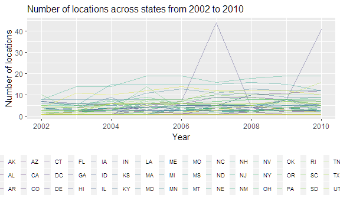

p8105\_hw3\_yc3242
================
Youn Kyeong Chang (uni\# yc3242)
October 10, 2018

I used the tidyverse library and some options for outset through the whole problem set.

``` r
library(tidyverse)
```

    ## -- Attaching packages -------------------------------------------------------- tidyverse 1.2.1 --

    ## v ggplot2 3.0.0     v purrr   0.2.5
    ## v tibble  1.4.2     v dplyr   0.7.6
    ## v tidyr   0.8.1     v stringr 1.3.1
    ## v readr   1.1.1     v forcats 0.3.0

    ## -- Conflicts ----------------------------------------------------------- tidyverse_conflicts() --
    ## x dplyr::filter() masks stats::filter()
    ## x dplyr::lag()    masks stats::lag()

``` r
knitr::opts_chunk$set(
  # fig.width = 6,
  # fig.asp = .6,
  out.width = "90%"
)

theme_set(theme_bw() + theme(legend.position = "bottom"))
```

Problem 1
=========

First, I loaded the dataset for problem 1 from the following library.

``` r
library(p8105.datasets)
data("brfss_smart2010")
```

Next, I cleaned the data and focused on the `Overall Health` topic and organized responses as factor taking levels ordered from "Excellent" to "Poor".

``` r
response_levels = c("Excellent", "Very good", "Good", "Fair", "Poor")

brfss_smart2010 = brfss_smart2010 %>% 
  janitor::clean_names() %>%                          # clean variable names
  rename(state = locationabbr,
         location = locationdesc) %>% 
  filter(topic == "Overall Health") %>% 
  mutate(response = factor(response, levels = response_levels))
```

First, to find out the states which were observed at 7 locations in 2002, I retained distinct rows by state and location and counted the number of states.

``` r
brfss_smart2010 %>% 
  filter(year == 2002) %>%
  distinct(state, location) %>% 
  count(state)  %>% 
  filter(n == 7)
```

    ## # A tibble: 3 x 2
    ##   state     n
    ##   <chr> <int>
    ## 1 CT        7
    ## 2 FL        7
    ## 3 NC        7

In 2002, **CT, FL, NC** were observed at 7 locations.

Next, I made a “spaghetti plot” that shows the number of locations in each state from 2002 to 2010.

``` r
brfss_smart2010 %>% 
  group_by(state, year) %>%
  distinct(location) %>%
  mutate(n_location = n()) %>% 
  ggplot(aes(x = year, y = n_location)) +
  geom_line(aes(color = state)) +
  labs(
    title = "Number of locations across states from 2002 to 2010",
    x = "Year",
    y = "Number of locations"
  ) +
  theme(plot.title = element_text(size = 16),
        legend.key.width = unit(.3, "cm"),
        legend.text = element_text(size = 7)) +
  guides(color = guide_legend(ncol = 17)) +
  viridis::scale_color_viridis(
    name = "State",
    discrete = TRUE
    ) 
```



This spaghetti plot shows that from 2002 to 2010, the number of locations of state seems constant, slightly fluctuating below 20 except that there is a huge surge in 2007 and 2010 in Florida.

Also, I made a table showing, for the years 2002, 2006, and 2010, the mean and standard deviation of the proportion of “Excellent” responses across locations in NY State.

``` r
brfss_smart2010 %>%
  filter(year %in% c(2002, 2006, 2010), 
         state == "NY", 
         response == "Excellent") %>% 
  group_by(year) %>% 
  summarize("Average proportion of Excellent(%) " = mean(data_value), 
            "Standard deviation of proportion of Excellent(%)" = sd(data_value)) %>% 
  knitr::kable(digits = 2)
```

|  year| Average proportion of Excellent(%) |  Standard deviation of proportion of Excellent(%)|
|-----:|:----------------------------------:|-------------------------------------------------:|
|  2002|                24.04               |                                              4.49|
|  2006|                22.53               |                                              4.00|
|  2010|                22.70               |                                              3.57|

The average and deviation of the proportion of Excellent responses across locations in NY state were the highest in 2002 and the values are similar in 2006 and 2010.

For each year and state, I computed the average proportion in each response category (taking the average across locations in a state) and made a five-panel plot that shows, for each response category separately, the distribution of these state-level averages over time.

``` r
brfss_smart2010 %>% 
  group_by(year, state, response) %>% 
  summarize(mean_response = mean(data_value)) %>% 
  ggplot(aes(x = mean_response, fill = as.factor(year))) +     
  geom_density(alpha = .4) +
  facet_grid(~ response) +
  labs(
    x = "Average proportion(%)",
    y = "Density",
    title = "Average proportion in each response category from 2002 to 2010"
  ) +
  scale_x_continuous(breaks = c(0, 10, 20, 30, 40, 50),
                     limits = c(0, 45)) +
  scale_y_continuous(limits = c(0, 0.5)) +
  viridis::scale_fill_viridis(
    name = "Year",
    discrete = TRUE) 
```

    ## Warning: Removed 21 rows containing non-finite values (stat_density).


Given that for every category, the density plots by years are overlapped, we can conclude that the trend of responses is similar over time. The mean of average proportion is ordered as Very good &gt; Good &gt; Excellent &gt; Fair &gt; Poor from the highest and the lowest. Even though the poor response has the lowest mean of average proportion, the density is the highest and its deviation is very narrow.

Problem 2
=========

First, I loaded the dataset for problem 2 from the following library.

``` r
library(p8105.datasets)
data("instacart") 
```

This `instacart` data is composed of **1384617** rows and **15** columns, where each row is corresponding to a product from an order. Each column represents as follows:

-   `order_id`: order identifier
-   `product_id`: product identifier
-   `add_to_cart_order`: order in which each product was added to cart
-   `reordered`: 1 if this prodcut has been ordered by this user in the past, 0 otherwise
-   `user_id`: customer identifier
-   `eval_set`: which evaluation set this order belongs in (Note that the data for use in this class is exclusively from the “train” eval\_set)
-   `order_number`: the order sequence number for this user (1=first, n=nth)
-   `order_dow`: the day of the week on which the order was placed
-   `order_hour_of_day`: the hour of the day on which the order was placed
-   `days_since_prior_order`: days since the last order, capped at 30, NA if order\_number=1
-   `product_name`: name of the product
-   `aisle_id`: aisle identifier
-   `department_id`: department identifier
-   `aisle`: the name of the aisle
-   `department`: the name of the department

From key variables such as `reordered`, `user_id`, `order_dow`, `order_hour_of_day`, `product_name`, `aisle` and `department`, some interesting findings are as below:

-   Fresh fruits and vegetables are reordered frequently.

``` r
instacart %>% 
  group_by(aisle) %>% 
  filter(reordered == 1) %>%
  count() %>% 
  arrange(desc(n))
```

    ## # A tibble: 134 x 2
    ## # Groups:   aisle [134]
    ##    aisle                              n
    ##    <chr>                          <int>
    ##  1 fresh fruits                  110782
    ##  2 fresh vegetables               91368
    ##  3 packaged vegetables fruits     51523
    ##  4 yogurt                         37939
    ##  5 water seltzer sparkling water  27011
    ##  6 milk                           25864
    ##  7 packaged cheese                24897
    ##  8 chips pretzels                 18649
    ##  9 soy lactosefree                18046
    ## 10 bread                          16073
    ## # ... with 124 more rows

-   Orders tend to be made from 10 am to 5 pm.

``` r
instacart %>% 
  count(order_hour_of_day) %>% 
  arrange(desc(n))
```

    ## # A tibble: 24 x 2
    ##    order_hour_of_day      n
    ##                <int>  <int>
    ##  1                14 119370
    ##  2                15 116198
    ##  3                13 114762
    ##  4                11 114119
    ##  5                12 111752
    ##  6                10 110479
    ##  7                16 110237
    ##  8                17  96944
    ##  9                 9  93856
    ## 10                18  76522
    ## # ... with 14 more rows

-   In general, 9 purchases were made per one person and 80 purchases at max.

``` r
instacart %>% 
  count(user_id) %>% 
  summarize(order_max = max(n), 
            order_median = median(n), 
            order_min = min(n),
            order_mean = round(mean(n), 1)) %>% 
  knitr::kable()
```

|  order\_max|  order\_median|  order\_min|  order\_mean|
|-----------:|--------------:|-----------:|------------:|
|          80|              9|           1|         10.6|

-   **\[Question\]** There are **134** aisles in the dataset.

-   **\[Question\]** The aisles below are the most items ordered from.

``` r
instacart %>% 
  count(aisle) %>% 
  top_n(3) %>% 
  knitr::kable()
```

    ## Selecting by n

| aisle                      |       n|
|:---------------------------|-------:|
| fresh fruits               |  150473|
| fresh vegetables           |  150609|
| packaged vegetables fruits |   78493|

I made a plot that shows the number of items ordered in each aisle.

``` r
instacart %>%
  count(aisle) %>% 
  mutate(aisle = forcats::fct_reorder(aisle, n, .asc = TRUE)) %>% 
  ggplot(aes(x = aisle, y = n)) + 
  geom_bar(stat = "identity",                 ## bar represents values not count
           size = .3,
           fill = "#E69F00",
           position = position_dodge(width = 1)) +
    labs(title = "Number of items ordered in each aisle",
       x = "Number of orders",
       y = "Aisle") +
   coord_flip() +                               ## Flip figure
   theme(axis.text.y = element_text(hjust = 1, vjust = .5, size = 5)) 
```


Make a table showing the most popular item in each of the aisles “baking ingredients”, “dog food care”, and “packaged vegetables fruits”.

``` r
instacart %>%
  filter(aisle %in% c("baking ingredients", "dog food care", "packaged vegetables fruits")) %>% 
  group_by(aisle) %>% 
  count(product_name) %>% 
  filter(min_rank(desc(n)) == 1)
```

    ## # A tibble: 3 x 3
    ## # Groups:   aisle [3]
    ##   aisle                    product_name                                  n
    ##   <chr>                    <chr>                                     <int>
    ## 1 baking ingredients       Light Brown Sugar                           499
    ## 2 dog food care            Snack Sticks Chicken & Rice Recipe Dog T~    30
    ## 3 packaged vegetables fru~ Organic Baby Spinach                       9784

Make a table showing the mean hour of the day at which Pink Lady Apples and Coffee Ice Cream are ordered on each day of the week; format this table for human readers (i.e. produce a 2 x 7 table).

``` r
days = 
  c("Sunday", "Monday", "Tuesday", "Wednesday", "Thursday", "Friday", "Saturday")

instacart %>%
  filter(product_name %in% c("Pink Lady Apples", "Coffee Ice Cream")) %>% 
  group_by(product_name, order_dow) %>% 
  summarize(mean = mean(order_hour_of_day)) %>% 
  mutate(order_dow = factor(days[order_dow + 1], levels = days)) %>% 
  spread(key = order_dow, value = mean)
```

    ## # A tibble: 2 x 8
    ## # Groups:   product_name [2]
    ##   product_name     Sunday Monday Tuesday Wednesday Thursday Friday Saturday
    ##   <chr>             <dbl>  <dbl>   <dbl>     <dbl>    <dbl>  <dbl>    <dbl>
    ## 1 Coffee Ice Cream   13.8   14.3    15.4      15.3     15.2   12.3     13.8
    ## 2 Pink Lady Apples   13.4   11.4    11.7      14.2     11.6   12.8     11.9

0 = Sunday

Problem 3
=========

``` r
library(p8105.datasets)
data("ny_noaa")
```

Do some data cleaning. Create separate variables for year, month, and day. Ensure observations for temperature, precipitation, and snowfall are given in reasonable units. For snowfall, what are the most commonly observed values? Why?

``` r
ny_noaa = ny_noaa[sample(1:nrow(ny_noaa), 1e05), ] 
ny_noaa = 
  ny_noaa %>% 
  separate(date, into = c("year", "month", "day"), sep = "-") %>% 
  mutate(prcp = prcp / 10,
         tmax = as.numeric(tmax) / 10,
         tmin = as.numeric(tmin) / 10)
```

``` r
ny_noaa %>% count(snow) %>% top_n(3)
```

    ## Selecting by n

    ## # A tibble: 3 x 2
    ##    snow     n
    ##   <int> <int>
    ## 1     0 77300
    ## 2    25  1126
    ## 3    NA 14858

Make a two-panel plot showing the average max temperature in January and in July in each station across years. Is there any observable / interpretable structure? Any outliers?

``` r
library(patchwork)

Jan_tmax_mu = 
  ny_noaa %>%
  filter(month == "01") %>% 
  group_by(id, month) %>% 
  summarize(mean = mean(tmax, na.rm = TRUE)) %>%
  ggplot(aes(x = id, y = mean)) +
  geom_point() 

July_tmax_mu = 
  ny_noaa %>%
  filter(month == "07") %>% 
  group_by(id, month) %>% 
  summarize(mean = mean(tmax, na.rm = TRUE)) %>%
  ggplot(aes(x = id, y = mean)) +
  geom_point()

Jan_tmax_mu / July_tmax_mu
```

    ## Warning: Removed 376 rows containing missing values (geom_point).

    ## Warning: Removed 402 rows containing missing values (geom_point).


Make a two-panel plot showing (i) tmax vs tmin for the full dataset (note that a scatterplot may not be the best option); and (ii) make a plot showing the distribution of snowfall values greater than 0 and less than 100 separately by year.

``` r
ny_noaa %>% 
  filter(snow < 100, snow > 0) %>% 
  ggplot(aes(x = snow)) +
  geom_density() +
  facet_grid(~ year)
```


To that end, write a short description of the dataset, noting the size and structure of the data, describing some key variables, and indicating the extent to which missing data is an issue. Then, do or answer the following (commenting on the results of each):
